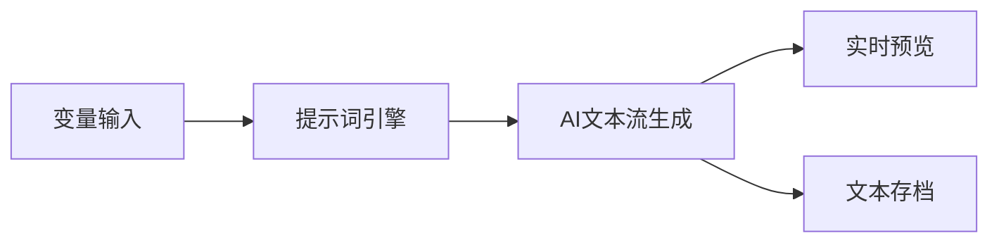

# AITextStream - 智能文本流生成工具


面向ComfyUI的智能文本生成工作流解决方案，支持多变量提示词引擎和大模型API集成。
模仿了Dify.ai的工作流，可自行接入模型提供商的api作为文本生成的核心。

## 功能亮点 ✨

- **动态变量替换** - 支持10个变量同时注入提示词
- **多模型兼容** - 默认集成DeepSeek，可扩展其他大模型
- **双输出模式** - 实时文本预览 + 本地文件保存
- **工作流模板** - 提供即用型JSON模板快速启动

## 文件结构 📁

```bash
AITextStream/
├── __init__.py                 # 节点注册入口
├── Novel_Seek.py               # 核心功能实现
└── workflow/
    └── TEST1.json              # 示例工作流模板
```

## 快速开始 🚀

### 前置要求
- ComfyUI 最新版本
- Python 3.8+
- requests 库

### 安装步骤
1. 克隆仓库到ComfyUI自定义节点目录
```bash
cd ComfyUI/custom_nodes
git clone https://github.com/yourusername/AITextStream.git
```

2. 安装依赖
```bash
pip install requests
```

3. 重启ComfyUI服务

### 配置指南
1. 获取API密钥（以DeepSeek为例）
2. 在工作流中配置LLM节点：
```json
"api_key": "your_api_key_here",
"api_url": "https://api.deepseek.com/v1/chat/completions"
```

## 节点说明 🧩

| 节点名称          | 图标 | 功能描述                     |
|-------------------|------|----------------------------|
| 变量输入          | 📦   | 定义可复用文本变量           |
| 提示词引擎        | 🎮   | 支持动态替换的提示词处理器    |
| AI文本流生成      | 🤖   | 大模型API调用核心            |
| 实时预览          | 👁️  | 生成内容即时显示             |
| 文本存档          | 💾   | 本地文件保存功能             |

## 使用示例 🧪

1. 导入工作流模板
```bash
将 TEST1.json 放入 ComfyUI/workflows 目录
```

2. 示例工作流结构：


3. 典型应用场景：
```python
# 小说章节生成
变量 = {"genre": "科幻", "protagonist": "AI工程师"}
提示词 = "创作一个关于{genre}的故事，主角是{protagonist}..."
```

## 高级配置 ⚙️

### 自定义模型接入
1. 修改LLMNode类中的API参数
2. 支持模型列表：
- DeepSeek
- OpenAI
- 智谱AI（需修改请求格式）

### 变量扩展
```python
# 添加新变量输入
class CustomVariablesNode(VariablesInputNode):
    """ 扩展企业级变量处理 """
```

## 注意事项 ⚠️

1. API密钥安全
```diff
- 切勿将密钥提交到版本控制系统！
+ 建议使用环境变量管理敏感信息
```

2. 网络要求
- 确保服务器可访问目标API端点
- 超时设置建议：30秒

3. 模型限制
- 注意各平台的token限制
- 推荐最大生成长度：2000 tokens

## 贡献指南 👥

欢迎通过以下方式参与改进：
1. 提交Issue报告问题
2. Fork仓库发起Pull Request
3. 添加新的工作流模板

## 许可证 📜

本项目采用 [MIT License](LICENSE)
